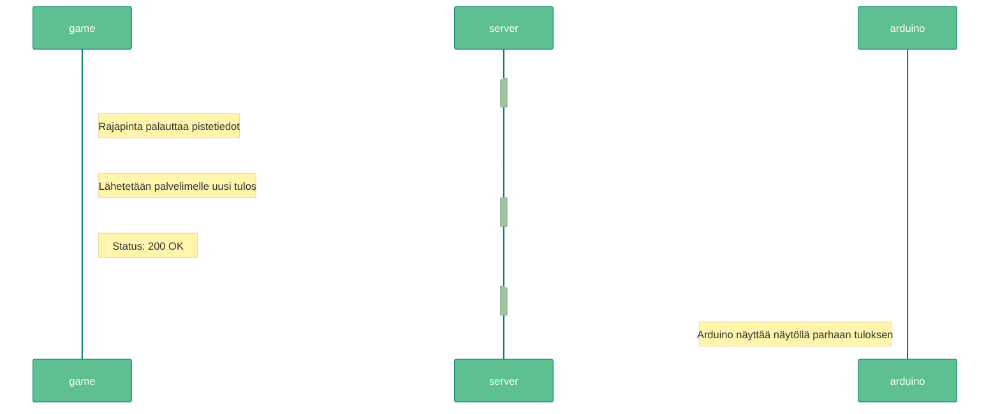

```mermaid

%%{
  init: {
    'theme': 'base',
    'themeVariables': {
      'primaryColor': '#5ebf90',
      'primaryTextColor': '#fff',
      'primaryBorderColor': '#007c70',
      'lineColor': '#29b6f8',
      'secondaryColor': '#a3c2a3',
      'tertiaryColor': '#fff'
    }
  }
}%%

sequenceDiagram
 participant game
 participant server
 participant arduino

 game->>server: GET https://api/scores
 activate server
 server-->> game: Status: 200 OK, Json-Data: {"scores": [{"username": "Testipelaaja​","time": 197...}]}
 deactivate server
 Note right of game: Rajapinta palauttaa pistetiedot

 game->>server: POST https://api/scores, Json-Data: {"username": "Testipelaaja​","time": 197}
 Note right of game: Lähetetään palvelimelle uusi tulos
 activate server
 server-->> game: Status: 200 OK,  Json-Data: {"username": "Testipelaaja​","time": 197, "date": Mon May..}
 deactivate server
 Note right of game: Status: 200 OK

 arduino->>server: GET https://api/scores
 activate server
 server-->> arduino: Status: 200 OK, Json-Data: {"scores": [{"username": "Testipelaaja​","time": 197...}]}
 deactivate server
 Note left of arduino: Arduino näyttää näytöllä parhaan tuloksen

  
```