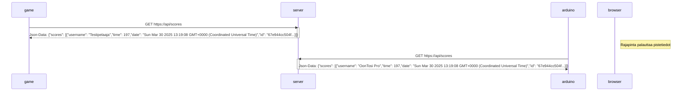

```mermaid
sequenceDiagram
 participant game
 participant server
 participant arduino

 game->>server: GET https://api/scores
 activate server
 server-->> game: Json-Data: {"scores": [{"username": "Testipelaaja​","time": 197,"date": "Sun Mar 30 2025 13:19:08 GMT+0000 (Coordinated Universal Time)","id": "67e944cc504f...}]}
 deactivate server
 Note right of browser: Rajapinta palauttaa pistetiedot

 arduino->>server: GET https://api/scores
 activate server
 server-->> arduino: Json-Data: {"scores": [{"username": "OonTosi Pro​","time": 197,"date": "Sun Mar 30 2025 13:19:08 GMT+0000 (Coordinated Universal Time)","id": "67e944cc504f...}]}
 deactivate server

  
```